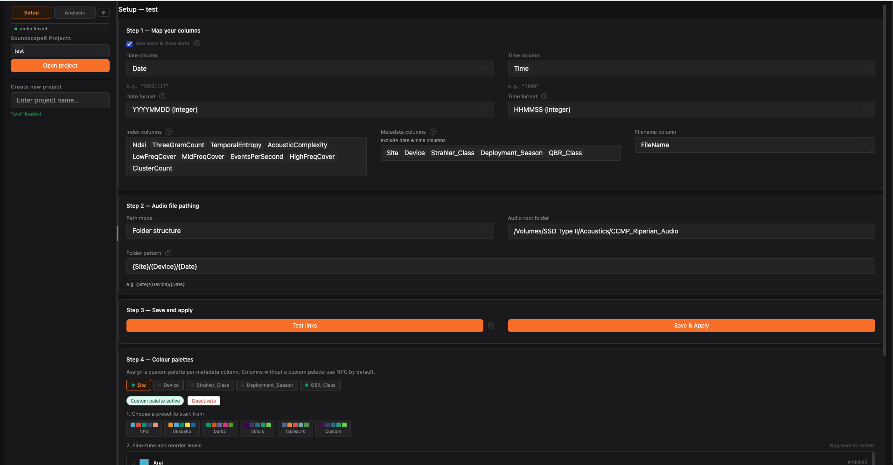
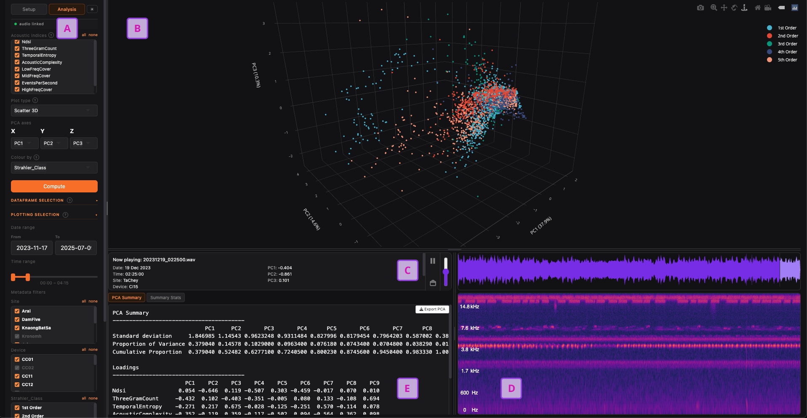

# SoundscapeR  
  
**Interactive analysis and visualisation for acoustic indices**  
  
SoundscapeR is an R Shiny application for exploring, visualising, and analysing acoustic indices datasets. The application provides an interactive, audio-enabled interface for investigating  soundscape or other acoustic data through:  
  
- Compound index analysis - combine multiple acoustic indices into PCA-derived compound indices to capture broader patterns in soundscape structure that no single index can reveal alone
- Diel pattern analysis
- Acoustic index correlation
- Interactive datapoint audio playback
- Waveform and spectrogram visualisation

##  Requirements  
SoundscapeR is compatible with Windows, macOS, and Linux.

- R ≥ 4.2
- RStudio (recommended)

All R package dependencies are installed automatically on first launch. No manual package installation is required.

## Installation

1. Clone or download this repository to a folder on your computer:
```bash
`git clone https://github.com/yourusername/SoundscapeR.git`
```
2. Open `app.R` in RStudio and click **Run App**. The SoundscapeR interface will launch in your browser or RStudio viewer.


## Data Checklist

Each SoundscapeR project requires a **single combined CSV dataset file** with one row per recording. 

Your CSV needs:

- One **filename** column matching your audio files
- One or more **acoustic index** columns (ACI, NDSI, ENT, etc.)
- Optional **metadata** columns (Site, Device, Deployment, etc.)
- Optional **date** and **time** columns

For additional data formatting information, see Preparing your data at the end of this document.

### Supported audio formats

SoundscapeR automatically locates audio files with the following extensions: `.wav`, `.mp3`, `.flac`, `.ogg`, `.aif`, `.aiff`. Filenames in the CSV can be used with and without the extensions.

## Tutorial

### 1. Creating a project

After launching SoundscapeR, type a project name in the sidebar text input and click **Create project**. SoundscapeR generates the following folder structure:

```
SoundscapeR/
└── SoundscapeR_projects/
    └── Your_Project/
        ├── raw_data/       ← place your combined CSV here
        ├── figures/
        ├── outputs/
        └── config.json
```

Place your CSV dataset into `Your_Project/raw_data/`, then select the project from the sidebar dropdown and click **Open project**.

### 2. Setup

#### Step 1 — Map your columns

Select which columns in your CSV correspond to recording filenames, acoustic indices, metadata, dates, and times. 

When selecting dates and time column format, SoundscapeR shows a preview of column values so you can confirm you have the right column before applying.

If your data has no date or time columns, uncheck **Use date & time data** — this hides the date and time selectors and disables diel plot types.

#### Step 2 — Audio file pathing

To activate click-to-hear functionality, set the **audio root folder** (the top-level drive or folder containing your raw recordings) and choose a path mode:

- **Folder structure** — describe your folder layout using `{ColumnName}` tokens, e.g. `{Site}/{Device}/{Date}`
- **Full paths in CSV** — if your CSV has a column with complete file paths, select it here

Click **Test links** to verify SoundscapeR can find your files. The audio status indicator below the sidebar tab will turn green when files are accessible.

Audio is optional — SoundscapeR works fully without it, but click-to-hear will be disabled.

#### Step 3 — Save & Apply

Click **Save & Apply** to load your data into the analysis panel and save your settings. Settings are restored automatically next time you open the project.

#### Step 4 — Colour palettes

Customise colours for each metadata group. Choose from built-in presets or adjust individual colours. Drag rows to reorder the legend. Click **Save palette** to persist changes across sessions.

#### Visualisation Mode

SoundscapeR launches in dark mode by default. Click the **☽ / ☀** button at the top of the sidebar to toggle. Your preference is saved and restored on next launch.


### Analysis Tab
Switch to the **Analysis** tab on the top left corner of the application window to start data exploration. SoundscapeR allows subsetting of your data for both analyses and plotting , with summary statistics for full analyses, as well as audio waveform and spectrogram generation for understanding of acoustic data drivers. 



#### A — Sidebar

- **Index selection** — choose which acoustic indices to include in the full analysis
- **Plot type** — choose from Scatter 3D, Scatter 2D, Diel Line 2D, Diel Line 3D, Boxplot, or Index Correlation
- **Axes Selection** — select which indices or principal components to display 
- **Colour by** — choose the metadata column used to colour datapoints
- **Compute** — runs the analysis and renders the plot
- **Dataframe selection** — filter which recordings are included in the primary analysis
- **Plotting selection** — independently filter which recordings are plotted from the primary analysis

#### B — Main plot

The central interactive plot. All plot types except Index Correlation support **click-to-hear** — click any datapoint to load and play the corresponding audio file.

Selecting 1–3 indices bypasses PCA and plots those indices directly. When 4 or more acoustic indices are selected, SoundscapeR runs a Principal Components Analysis (PCA) across all indices. The resulting PC scores are used as compound indices axes. 

| Plot type         | Description and Calculation                                     |
| ----------------- | --------------------------------------------------------------- |
| Scatter 3D        | Indices / PCA-derived ordination in 3D space                    |
| Scatter 2D        | Indices / PCA-derived ordination in 2D space                    |
| Diel Line 2D      | Mean index / compound index value by time of day                |
| Diel Line 3D      | Mean of two indices / compound indices by time of day           |
| Boxplot           | Distribution of a compound index by metadata group              |
| Index Correlation | Pairwise Pearson correlation matrix to examine index redundancy |
#### C — Now playing

Shows the filename and metadata for the currently selected recording.

| Control       | Function                             |
| ------------- | ------------------------------------ |
| ▶             | Play / pause                         |
| Volume slider | Adjusts gain (0–2×)                  |
| Folder        | Reveal the file in Finder / Explorer |

#### D — Waveform and spectrogram

Renders automatically when a recording is selected. Panel sizes can be adjusted by dragging the splitters.

#### E — PCA summary / Summary stats
When 1-3 indices are selected, shows **Index Summary** — mean, standard deviations (SD), median, min, max, and coefficient of variation (CV) per index, plus pairwise correlations if more than one index is selected. When 4+ indices are selected, the panel will print a **PCA Summary** explaining variance and loadings.

#### Exporting results

| Output                | Method                                  |
| --------------------- | --------------------------------------- |
| PCA scores + metadata | Click **Export** in the PCA Summary tab |
| Scatter / diel plots  | Camera icon in the plotly toolbar       |
| Correlation matrix    | User-device screenshot (sorry)          |

## Development Status
SoundscapeR is being actively developed and evolving. New analysis modules, visualization tools, and workflow improvements will be added continuously.

Contributions and collaborations are welcome.

## Acknowledgements

- [WaveSurfer.js](https://wavesurfer.xyz/) — waveform and spectrogram rendering
- [Plotly for R](https://plotly.com/r/) — interactive visualisation
- [GGally](https://ggobi.github.io/ggally/) — correlation matrix plots

## Additional Tips for Preparing your data

SoundscapeR works with **pre-computed acoustic indices** — it does not process raw audio itself. You will need to calculate indices from your recordings first, then bring the results together into a single combined CSV file before importing.

### Step 1 — Calculate your indices

Use one of the following free tools to extract acoustic indices from your audio recordings:

|Tool|Type|Notes|
|---|---|---|
|[soundecology](https://cran.r-project.org/package=soundecology)|R package|ACI, NDSI, NP, BI, ADI|
|[seewave](https://rug.mnhn.fr/seewave/)|R package|General acoustic analysis|
|[Kaleidoscope](https://www.wildlifeacoustics.com/products/kaleidoscope-pro)|Desktop app|Free version available|
|[QUT Ecoacoustics](https://ap.qut.ecoacoustics.info/)|Desktop app / CLI|Open source|

Each of these tools will produce a results file (usually a CSV) containing one row per recording and one column per index.

### Step 2 — Combine into one CSV

SoundscapeR requires a **single combined CSV** containing all your recordings and all your indices together. If you have calculated indices separately across different sites, devices, or time periods, you will need to merge these into one file before importing.

In R this is straightforward:

r

```r
library(dplyr)

# Load your individual results files
site_a <- read.csv("site_a_indices.csv")
site_b <- read.csv("site_b_indices.csv")

# Combine into one dataframe
all_data <- bind_rows(site_a, site_b)

# Save
write.csv(all_data, "all_indices_combined.csv", row.names = FALSE)
```

In Excel or any spreadsheet application, you can paste the rows from each file below one another — just make sure the column names match across files.

### Step 3 — Check your CSV structure

The combined CSV must have **one row per recording**. A typical file looks like this:

|FileName|Date|Time|Site|Device|ACI|ENT|NDSI|...|
|---|---|---|---|---|---|---|---|---|
|20230401_060000|20230401|60000|RiverA|SM4_01|1243.2|0.87|0.34|...|
|20230401_063000|20230401|63000|RiverA|SM4_01|1189.4|0.91|0.41|...|

Columns should include:

|Column type|Required?|Description|
|---|---|---|
|Filename|Yes|Audio filename — with or without file extension|
|Acoustic indices|Yes|One column per index — these are what SoundscapeR analyses|
|Metadata|Recommended|Categorical columns like Site, Device, Season — used for grouping, filtering, and colouring|
|Date|Optional|Date of recording — several formats supported (see below)|
|Time|Optional|Time of recording — several formats supported (see below)|

> **Tip:** The more indices you include, the more information SoundscapeR can draw on for compound index analysis. Including 6–10 indices typically gives good results.

### Supported date formats

|Format|Example|
|---|---|
|YYYYMMDD (integer)|`20230401`|
|YYYY-MM-DD|`2023-04-01`|
|DD/MM/YYYY|`01/04/2023`|
|MM/DD/YYYY|`04/01/2023`|
|YYYY/MM/DD|`2023/04/01`|
|DD-MM-YYYY|`01-04-2023`|
|Combined datetime|`2023-04-01 06:00:00`|

### Supported time formats

|Format|Example|
|---|---|
|HHMMSS (integer)|`60000`|
|HH:MM:SS|`06:00:00`|
|HH:MM|`06:00`|
|Minutes since midnight|`360`|
|Seconds since midnight|`21600`|

When **Combined datetime** is selected as the date format, time is extracted automatically — no separate time column is needed.

If your data has no date or time information, that is fine — temporal features can be disabled in SoundscapeR's Setup.

### Audio folder structure

SoundscapeR constructs the path to each audio file by combining the **audio root folder**, a **subfolder pattern**, and the **filename** from your CSV. The subfolder pattern uses `{ColumnName}` tokens that are replaced with values from each row.

For example, given:

- Audio root: `/Volumes/AudioDrive/Acoustics/`
- Folder pattern: `{Site}/{Device}/{Date}`
- A row with `Site = RiverA`, `Device = SM4_01`, `Date = 20230401`, `FileName = 20230401_060000`

SoundscapeR will look for:

```
/Volumes/AudioDrive/Acoustics/RiverA/SM4_01/20230401/20230401_060000.wav
```

Common folder conventions:

```
AudioRoot/
├── {Site}/{Date}/recording.wav
├── {Site}/{Device}/{Date}/recording.wav
└── {Deployment}/recording.wav
```

If your CSV already contains complete file paths, select **Full paths in CSV** as the path mode and choose that column — SoundscapeR will use the paths directly.

